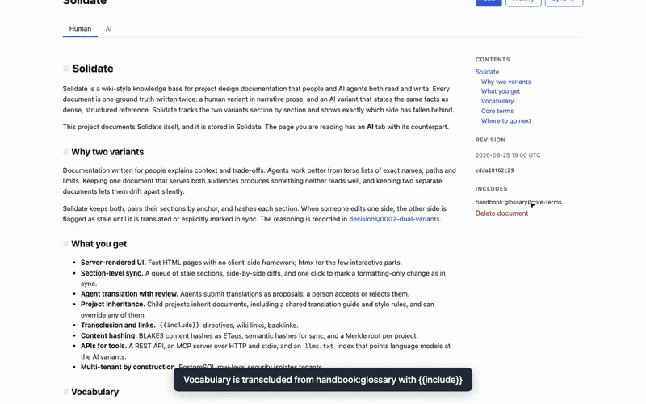

# Solidate: Knowledge for humans!... and also AI!

Solidate is a clean, efficient, wiki-style knowledge base for project design documentation that people and AI agents both read and write.
Every document is one ground truth written twice: a human variant in narrative prose, and an AI variant that states the same facts as dense, structured reference.
Solidate pairs the two variants section by section, hashes each section, and shows which side has fallen behind so both can be kept in sync.

## Walkthrough

[](demo/showcase/recording/solidate-walkthrough.mp4)

[`demo/showcase/recording/solidate-walkthrough.mp4`](demo/showcase/recording/solidate-walkthrough.mp4) covers sign-in, the project home, a document in both variants, the sync queue, conflict details, accepting an agent proposal, translating a section by hand, an agent translating over REST, history, search and `llms.txt`.
It is recorded against the showcase data in [demo/showcase](demo/showcase/README.md), which is Solidate's own documentation stored in Solidate.

## Features

- **Server-rendered UI.** HTML rendered on the server with Topcoat; htmx for the few interactive parts, no client-side framework.
- **Dual variants.** Each document has a human (`x.md`) and AI (`x.ai.md`) variant, paired by section anchor.
- **Section-level sync.** A queue of stale sections, side-by-side diffs, conflict detection, and one-click resolution for formatting-only changes.
- **Agent translation with review.** Agents submit translations as proposals; a person accepts or rejects them.
- **Project inheritance.** Child projects inherit documents (shared glossary, style rules, translation guide) and can override any of them.
- **Transclusion and links.** `{{include project:doc#section}}` directives, `[[wiki links]]`, backlinks.
- **Content hashing.** BLAKE3 content hashes as ETags and for optimistic concurrency, semantic hashes for sync, and a Merkle root per project.
- **APIs for tools.** REST API, MCP server (streamable HTTP and stdio), and an `llms.txt` index.
- **Multi-tenant.** PostgreSQL row-level security isolates tenants; scoped, optionally project-restricted API tokens; audit log; per-token rate limits.

## Repository layout

| Path | Contents |
|---|---|
| [crates/solidate-core](crates/solidate-core) | Pure domain logic: Markdown analysis, hashing, links, includes, inheritance, diffs, sync state. No I/O. |
| [crates/solidate-db](crates/solidate-db) | PostgreSQL storage: migrations, tenant-scoped transactions, repositories. |
| [crates/solidate-app](crates/solidate-app) | Use-case services shared by all front ends: auth, documents, projects, sync, proposals, search, audit, rate limiting, telemetry. |
| [crates/solidate-web](crates/solidate-web) | `solidate-server` binary: server-rendered UI, REST API, and the `/mcp` HTTP endpoint. |
| [crates/solidate-mcp](crates/solidate-mcp) | MCP tools and resources; `solidate-mcp` stdio binary. |
| [crates/solidate-cli](crates/solidate-cli) | `solidate` admin binary: migrations, tenants, users, projects, tokens, import/export, sync queue, audit log. |
| [demo/showcase](demo/showcase) | Seed data, seed script, and walkthrough recording. |

Dependencies flow `core → db → app → {web, mcp, cli}`; `web` also mounts `mcp`.

## Quickstart

Requires Docker with Compose.

```sh
docker compose up -d
```

This starts PostgreSQL 17 (host port 5433), applies migrations via the one-shot `cli` service, and serves Solidate on <http://localhost:3000> (health at `/healthz`).

Administration runs through the CLI service:

```sh
docker compose run --rm cli tenant create acme "Acme Corp"
docker compose run --rm -e SOLIDATE_PASSWORD=change-me-now cli user create ada@acme.dev "Ada Lovelace"
docker compose run --rm cli user member acme ada@acme.dev admin
docker compose run --rm cli project create acme docs "Documentation"   # --parent <slug> to inherit
docker compose run --rm -v ./docs:/import cli import acme docs /import   # optional: load x.md / x.ai.md files
```

Sign in at <http://localhost:3000/login>.

### Connecting an agent

```sh
docker compose run --rm cli token create acme claude --scope write --project docs
claude mcp add --transport http solidate http://localhost:3000/mcp \
  --header "Authorization: Bearer sol_…"
```

For local use without the server, `solidate-mcp` serves the same tools over stdio using `DATABASE_URL` and `SOLIDATE_TOKEN`.

## Development

```sh
cp .env.example .env
docker compose up -d postgres
cargo run -p solidate-cli -- migrate
cargo run -p solidate-web            # solidate-server on 127.0.0.1:3000
```

Configuration is by environment variable; see [.env.example](.env.example).
CI runs `cargo fmt --all --check`, `cargo clippy --workspace --all-targets -- -D warnings`, `cargo test --workspace` against PostgreSQL, and a Docker build.
`#[sqlx::test]` tests create a database per test, so `DATABASE_URL` must be an owner/superuser connection.

## Tech stack

- Rust (edition 2024)
- Topcoat + htmx for the web layer
- Comrak for Markdown parsing
- SQLx and PostgreSQL 17 for the data layer
- BLAKE3 for hashing
- rmcp for the MCP server

## Further documentation

The full user, reference and architecture docs (including ADRs) live in [demo/showcase/solidate](demo/showcase/solidate), starting at [readme.md](demo/showcase/solidate/readme.md).
Load them into a running instance with [demo/showcase/seed.sh](demo/showcase/seed.sh).
